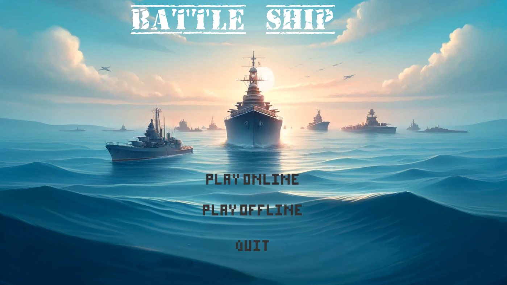
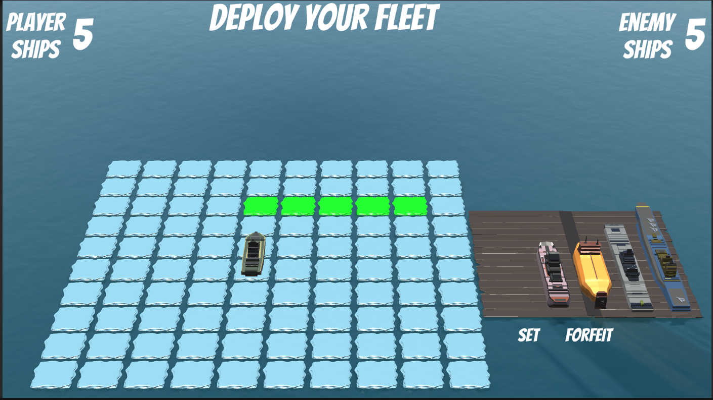
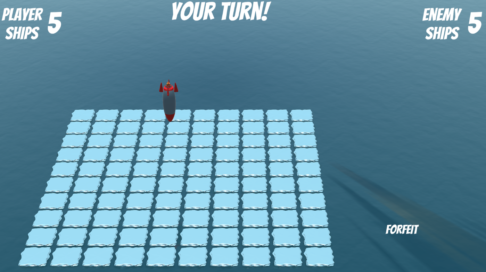
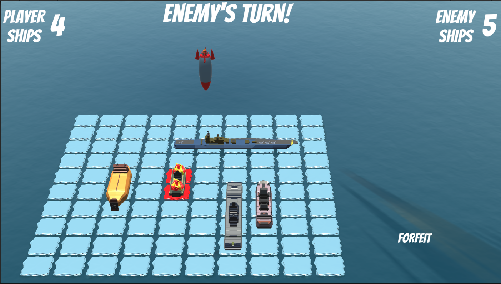
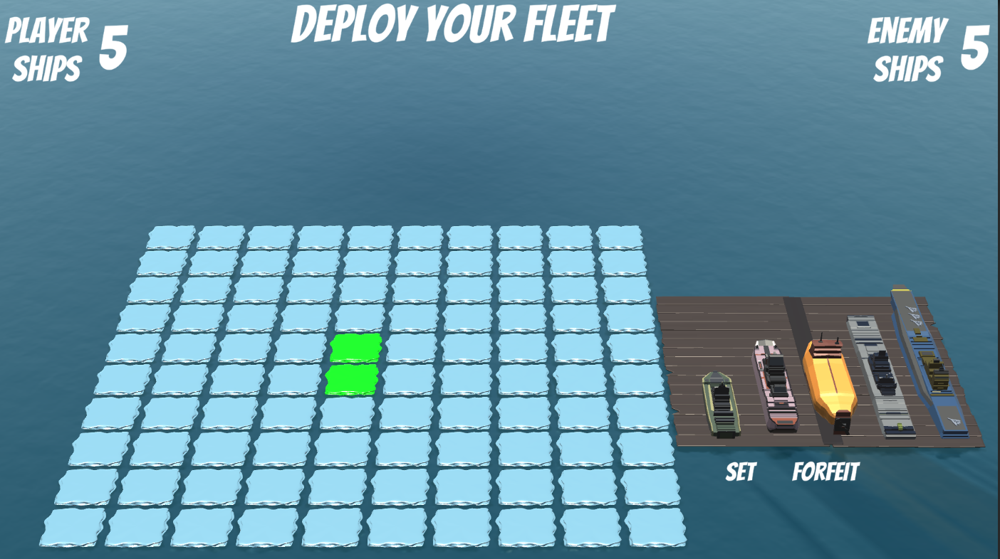
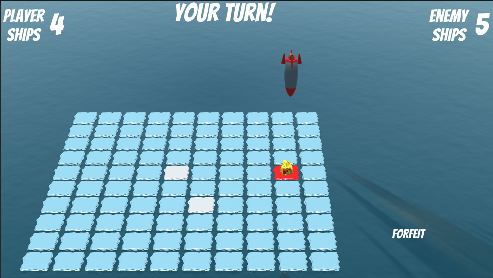
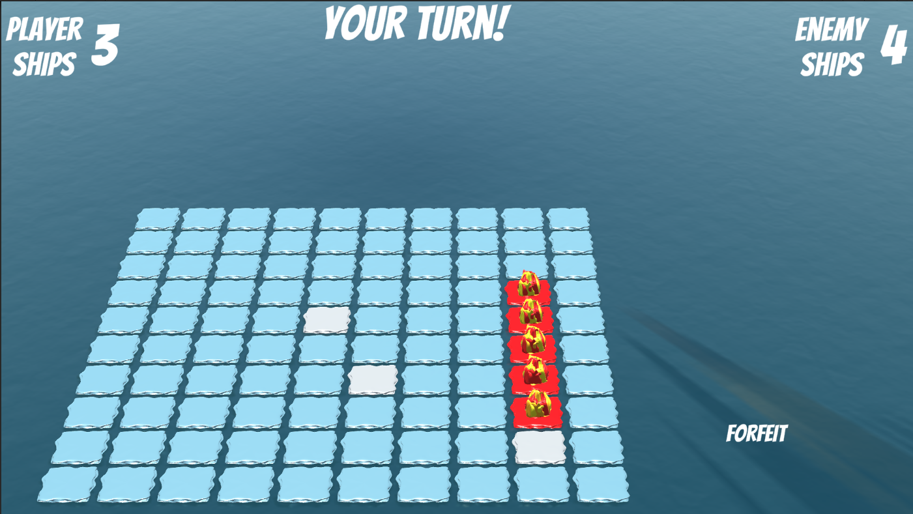

# 🚢 Battleship Game

A Unity-based 1v1 Battleship game featuring **Online Multiplayer (PvP)** and **Offline (PvC)** modes. The game is visually enhanced with 3D models and turn-based gameplay mechanics, and follows traditional Battleship rules with intuitive UI and visual feedback.

---

## 📽️ Gameplay Preview

Watch the full gameplay video here:  
▶️ [Click to watch the demo](https://youtu.be/_3vWfk4hiFM)

---

## 🎮 Game Modes

- **Play Online** – Player vs Player mode using Photon for real-time multiplayer.
- **Play Offline** – Player vs Computer mode using a strategy-based shooting system.
- **Quit** – Exit the game.

---

## 📦 Game Rules

### 🚢 Ships

Each player has a fleet of **5 ships**:

| Ship        | Length (Tiles) |
|-------------|----------------|
| Carrier     | 5              |
| Battleship  | 4              |
| Cruiser     | 3              |
| Submarine   | 3              |
| Destroyer   | 2              |

### 🧩 Deployment

- You must place your ships on your board before the game starts.
- Ships **cannot overlap**.
- Placement is allowed **horizontally** or **vertically** (not diagonally).
- Press `SET` after finishing your fleet deployment.

---

## 🎯 Shooting Turns

- In **PvC mode**, the **player always starts first**.
- In **PvP mode**, the **first player to enter the room** takes the first shot.
- Turns alternate between players.

When a ship is hit, it's marked. Once all the tiles of a ship are hit, it's destroyed.

---

## 🧠 Computer Strategy (PvC)

The computer uses a **logical shooting strategy** inspired by the paper:

> **"Developing a Strategy for Battleship"**  
> by E. Y. Rodin et al., Washington University, 1988  
> [Link to the paper](https://www.academia.edu/57012012/Developing_a_strategy_for_battleship_?sm=b)

📌 This strategy includes:
- **Strafing pattern** to locate ships efficiently.
- **Probability-based targeting**, prioritizing center over edges.
- **Destroy algorithm** once a ship is partially revealed.

This method provides better performance than random shots, especially when the opponent isn’t familiar with it.

---

## 📸 Gameplay Highlights

### Deploying Ships

### In-Game Action

---

## 📬 Contact

Created by **Fadi Srouji**

- 📧 Email: fadi_sroujii@outlook.com  
- 🔗 LinkedIn: [linkedin.com/in/fadisrouji](https://www.linkedin.com/in/fadisrouji)  
- 💼 GitHub: [github.com/FadiSro](https://github.com/FadiSro)  
- 🎥 Project Demo: [https://youtu.be/dVAsB5UlmQw](https://youtu.be/dVAsB5UlmQw)
